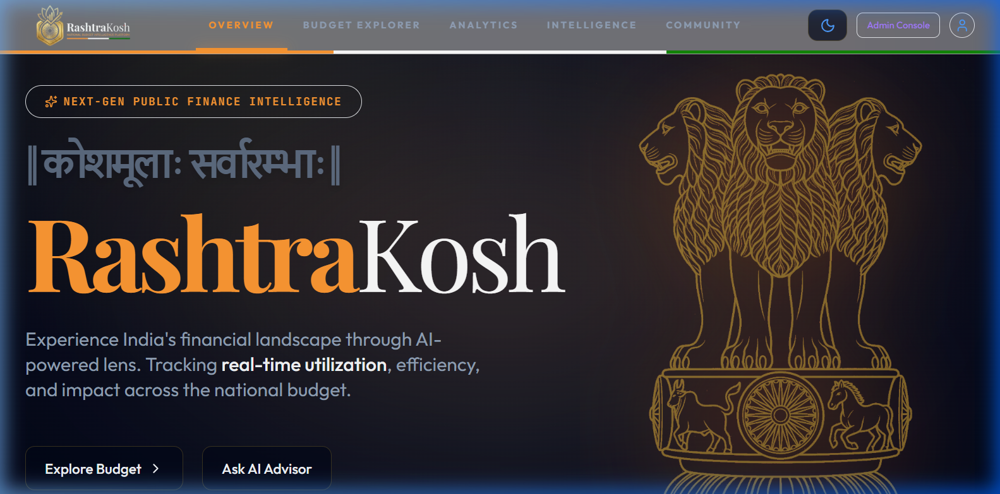
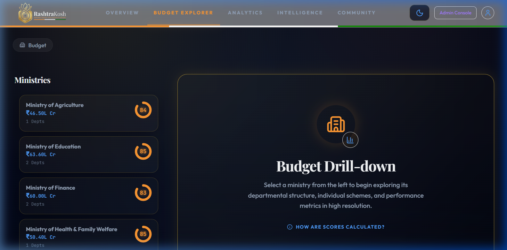
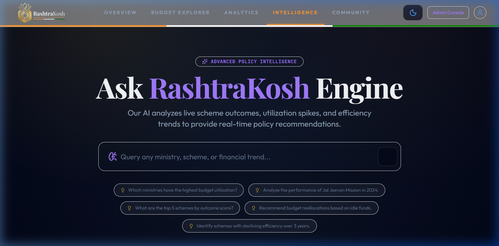
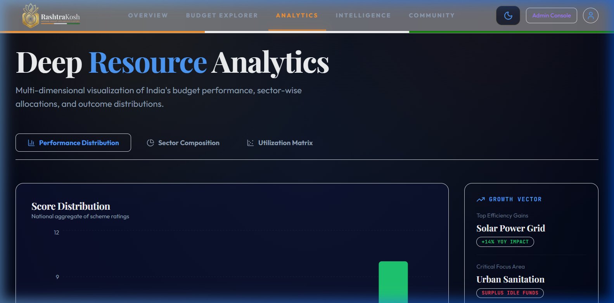

<div align="center">

# 🏛️ RashtraKosh
### **|| कोशमूलाः सर्वारम्भाः ||**
*Finance is the root of all endeavors*

**Premium AI-Powered Public Finance Intelligence & Budget Visualization Platform**

[](https://vercel.com)
[](https://nextjs.org)
[](https://tailwindcss.com)

---

[Overview](#-overview) • [Key Features](#-key-features) • [Tech Stack](#-technical-architecture) • [Setup](#-installation--setup) • [Architecture](#-project-structure)

</div>

## ✨ Vision
**RashtraKosh** is a state-of-the-art intelligence platform designed to bring radical transparency and AI-driven insights to the Indian Union Budget. By transforming complex treasury data into interactive, intuitive, and beautiful visualizations, RashtraKosh empowers citizens, analysts, and policy-makers to understand the national financial landscape in high resolution.

---

## ⚠️ Data Accuracy Disclaimer (Beta Platform)
> **Notice regarding Government Data:** The data presented on this platform is algorithmically extracted from official Government of India Outcome Budget and Demand for Grants PDF documents. While stringent data validation checks and variance flagging are implemented during the ingestion pipeline, extraction anomalies may occur. 
> 
> *This data is provided for illustrative, educational, and analytical purposes only, and should **not** be cited as an official administrative source of government financial figures.*

---

## 📸 Final Interface


*Modern Landing with Vintage Indian Aesthetic and Real-time KPI Tracking*

---

## 🚀 Key Features

### 🔍 1. Budget Explorer (Deep Drill-down)
Navigate through the layers of the Indian economy with surgical precision.
- **Hierarchical Drill-down**: Ministry → Department → Core Schemes.
- **Health Scoring**: Proprietary performance metrics for every financial entity.
- **Utilization Tracking**: Real-time monitoring of allocated vs. utilized funds.



### 🤖 2. RashtraKosh Intelligence (AI Advisor)
An AI-powered policy advisor that understands the nuances of public finance.
- **Natural Language Queries**: Ask complex questions about budget reallocations or policy impact.
- **Context-Aware Insights**: Leverages Anthropic Claude models for deep financial reasoning.
- **Predictive Analysis**: Intelligence on fiscal surplus and potential impact zones.



### 📊 3. Advanced Analytics & Visualization
Beautiful, high-density data visualizations that reveal the stories behind the numbers.
- **Macro Trends**: Visualization of sector-wise growth and allocation shifts.
- **Comparative Metrics**: Benchmarking departmental performance across fiscal years.



### 🏗️ 4. Admin Command Center
A unified console for treasury managers and analysts.
- **Automated PDF Ingestion**: Robust pipeline to extract, map, and ingest data from official Outcome Budgets and Demand for Grants PDFs.
- **Ingestion Audit Trail**: Dedicated dashboard to monitor, verify, and track the history of automated data ingestions.
- **Feedback Inbox**: Comprehensive interface to manage, filter, and process citizen feedback with internal notes and status tracking.
- **Policy Reallocation**: Tools to simulate budget shifts based on AI recommendations.

<div align="center">
  
  
</div>
<br/>
<div align="center">
  
  
</div>
*Comprehensive suite of tools for robust data and engagement management*

---

## 🛠️ Technical Architecture

### **Core Stack**
- **Framework**: [Next.js 14](https://nextjs.org/) (App Router, Server Actions)
- **Styling**: [Tailwind CSS](https://tailwindcss.com/) with Custom Glassmorphism System
- **Animations**: [Framer Motion](https://www.framer.com/motion/)
- **Database**: [Prisma ORM](https://www.prisma.io/) with PostgreSQL
- **Auth**: [Next-Auth (Auth.js v5)](https://authjs.dev/)
- **AI Integration**: [Vercel AI SDK](https://sdk.vercel.ai/) & [Anthropic Claude](https://www.anthropic.com/)
- **Visuals**: [Lucide React](https://lucide.dev/) & [Recharts](https://recharts.org/)

### **Performance & Security Design**
- **Security Hardening**: Strict input validation using Zod and comprehensive rate-limiting across all public endpoints and API routes.
- **Edge Compatible Auth**: Decoupled configuration for optimal middleware performance.
- **Optimized Assets**: Next.js `Image` component used for LCP performance.
- **Component Architecture**: Atomic design for reusable UI elements.

---

## 💻 Installation & Setup

### **Prerequisites**
- Node.js 18+ 
- PostgreSQL Database
- Anthropic API Key (for Intelligence features)

### **Local Development**
1. **Clone the repository**
   ```bash
   git clone https://github.com/your-username/India-Innovates.git
   cd India-Innovates/RashtraKosh
   ```

2. **Install Dependencies**
   ```bash
   npm install --legacy-peer-deps
   ```

3. **Configure Environment Variables**
   Create a `.env.local` file:
   ```env
   DATABASE_URL="postgresql://..."
   AUTH_SECRET="your-secret"
   ANTHROPIC_API_KEY="your-key"
   ```

4. **Database Setup**
   ```bash
   npx prisma generate
   npx prisma db push
   npx prisma db seed
   ```

5. **Start Dev Server**
   ```bash
   npm run dev
   ```

---

## 🏛️ Project Structure

```bash
RashtraKosh/
├── app/               # Next.js 14 App Router
│   ├── (admin)        # Admin Console Routes
│   ├── (auth)         # Authentication Pages
│   └── (public)       # Core User Facing Pages
├── components/        # Specialized UI Components
│   ├── ui/            # Atomic Design System
│   └── navigation/    # Navbar & Global Navigation
├── lib/               # Shared Utilities & Auth Config
├── prisma/            # Database Schema & Seed Logic
├── store/             # State Management (Zustand)
└── public/            # Static Assets & Documentation
```

---

## 📜 License
Distributed under the MIT License. See `LICENSE` for more information.

<div align="center">
  <p>Built with ❤️ for a Transparant and Resurgent India</p>
  <p><b>© 2026 RashtraKosh Team</b></p>
</div>
